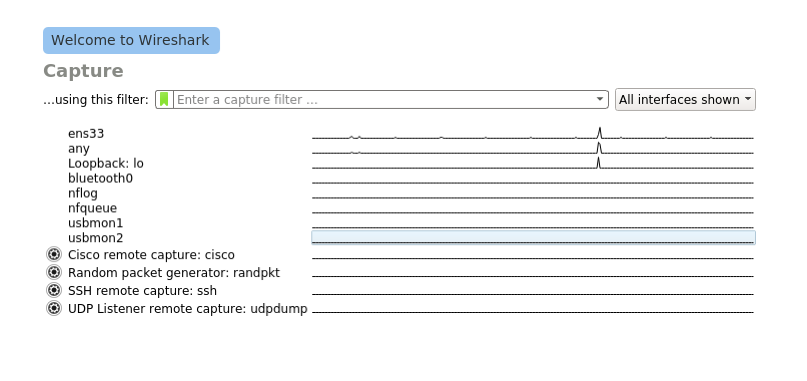
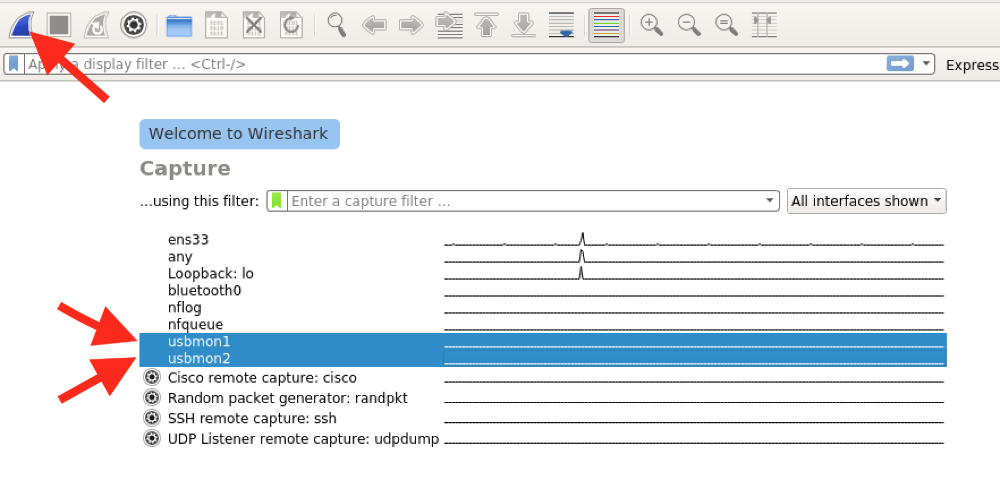
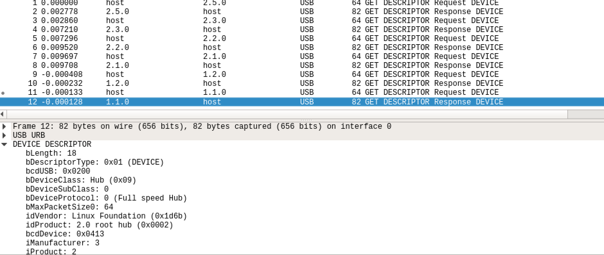

# Monitoring USB Communications with USBMon

When working with USB devices, it's often helpful to have insight into the data that's being exchanged between the _host_ and the _device_. There are several methods to inspect USB communciations as they occur:

* A <a href="https://www.totalphase.com/products/beagle-usb480/">USB protocol analyzer</a> is an expensive piece of equipment, but is the most flexible way of capturing USB communications.
* _USBProxy-Nouveau_ provides a simple ability to analyze the USB data being proxied. Use of USBProxy will be covered in the training course.
* _Software analyzers_ can be used on Linux and Mac. These analyzers are limited, and require control over the target-- but they're low cost and convenient.

In this training course, we'll use the Linux `usbmon` analyzer to capture traffic between your _host computer_ and a target _USB Device_. As a software-only solution, `usbmon` is an excellent zero-cost starting point. 

### Setting up USBMon

USBMon performs its monitoring from inside of a _Linux Kernel Module_, which has full access to all USB packets processed by the system. Accordingly, we'll need to load the module before we can use it:

```
sudo modprobe usbmon
```

### Viewing USBMon Output with Wireshark

The easiet wasy to view USBMon output is with _Wireshark_, a common suite used for protocol analysis. While it's not as full-featured as other USB analyzers, it has the significant benefit of being free.

You'll need to start Wireshark from an account that has USB privileges. From the training live CD, you can accomplisht this by running Wireshark as root. Generally, running Wireshark as root isn't a great idea; but for these more-disposible live environments, it's Good Enough (TM). 

To run wireshark:

```
sudo wireshark
```

If this reports an error connecting to the X Server you can enable all users to access your X instance-- again, a practice best avoided outside of the training live-usb environment:

```
xhost +
sudo wireshark
```

Once Wireshark has started, you'll be asked to select the interfaces you want to listen on. Each _USB_ interface begins with `usbmon` and ends with a number:



Each interface corresponds to a different USB "root hub" on your computer. We don't necessarily know where our device will wind up connected, so for now, we'll select all of them:



Once you've selected all of the interfaces, click on the blue "start" fin to begin capture. Attach a new USB device-- you should see USB packets being to fill the view!


